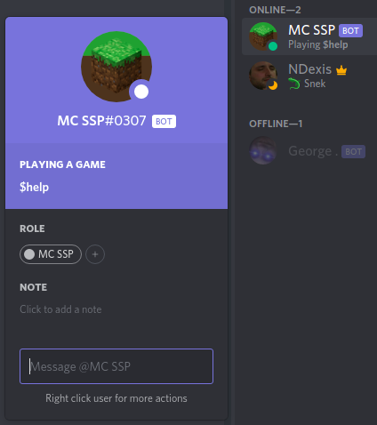
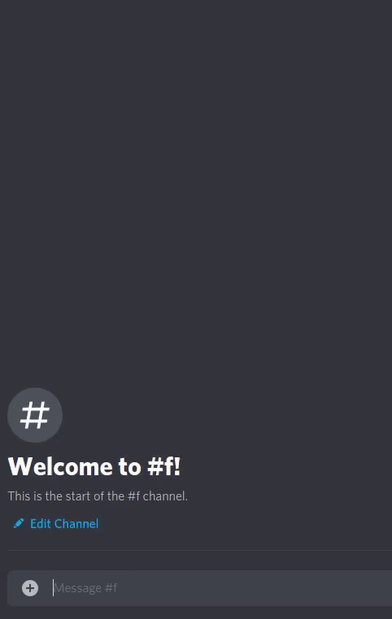

# MCSSP - Minecraft Server Stat Program

#### INFO

This is my first in-depth look at node.JS, bots, API's and discord bot making.

MCSSP can be added to any discord server, it's purpose is to tell you the status of a Minecraft server given it's IP.

If the server was down it would indicate it.

And if the server was running it would say how many people were online at the moment.

I based my data on this API : `https://mcsrvstat.us/server/`

The bot is fully functional, I've done some very fine tunning and bug fixing it's an official release. __v1.1.1__

#### Example

