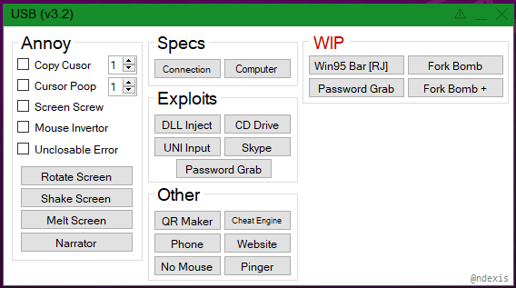

# USB

#### Info

This is probably the most controversial of all the apps that I made.

I would have it on a usb stick and have a panel to mess with someone's computer, most of the programs are not mine.

I was exploring the possibilities but I never harmed someone elses computer if you somehow get this program to work fully (the programs it executes are not in the repo), then I am not responsible for anything you might do with it.

#### Example

