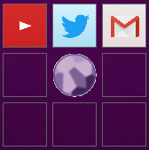

# Buttons

#### Info

This was just me messing around, trying to learn Visual Basic and C# without any prior knowledge of both.

My VB projects are some of my oldest, at this point my entire computing knowledge was composed of Windows Experience, Batch, Visual Basic Script and a very small knowledge of Python.

#### Idea

Make a floating box with clickable links to usefull webpages

My graphical skills at the time were trough the roof

#### Example

