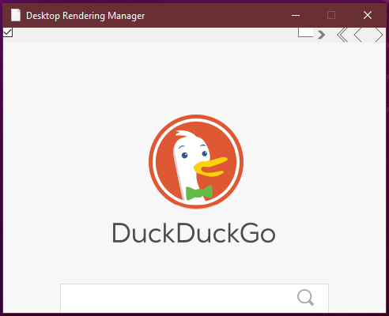

# Desktop Rendering Manager Service

#### Info

The title of this project is misleading, that's the point.

It's acutally a hidden web browser.

In the top left corner of the executable is a button you have 2px to press it this makes it very discreet.
Pressing again on the button will minimize the page again.

I used this to open websites at school without being seen.

#### Disclaimer

This browser has no security features so be really careful using it on which websites you visit and what you download.

