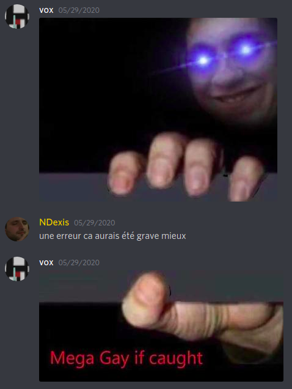

# George

#### Info

This is my second try at discord bot making in node.JS.

It's far from finished.

If anyone is interested in finishing this project please send me a message or a mail I really want to see the final product (philippe.cheype@epitech.eu)

#### The Idea

One night I was on discord with some friend when one of them made a joke sending a specific picture, waiting for a message to be sent after it and immediately after, sending the second specific picture.

Check the `george.js` file to see the images or look below in `Example`

This enclosed the person between the images and made fun of them. (This is a dumb joke, it's not intended to be make hate against LGBTQ+)

So the idea was for the bot to at a random interval send the images and capture people all day long.

#### Example

